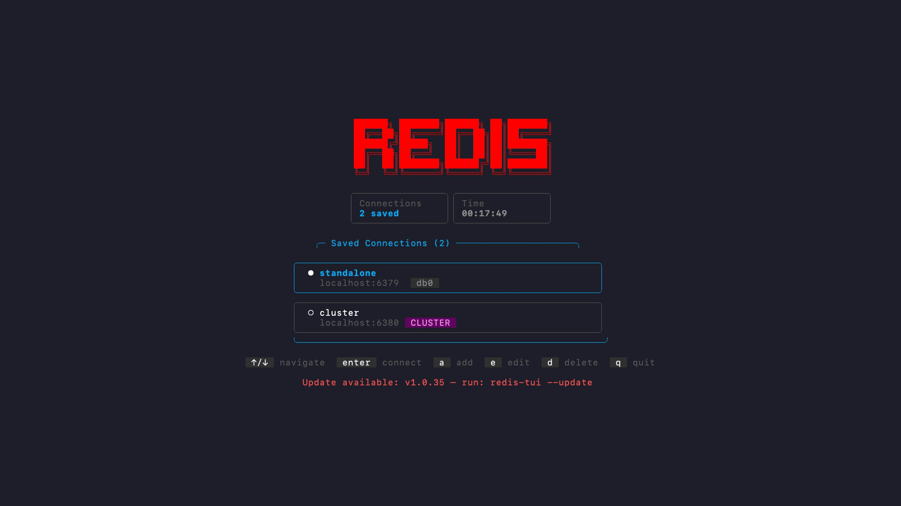
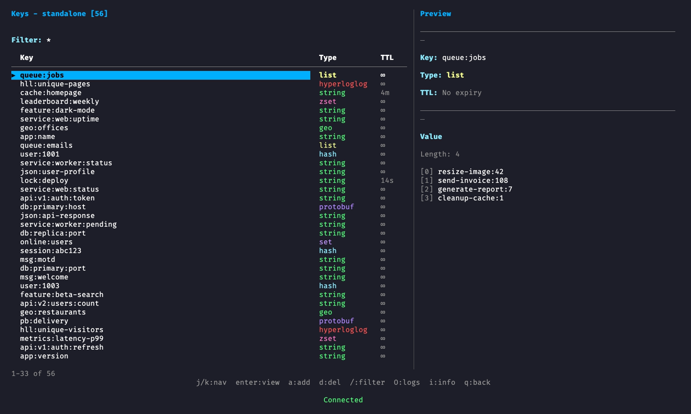
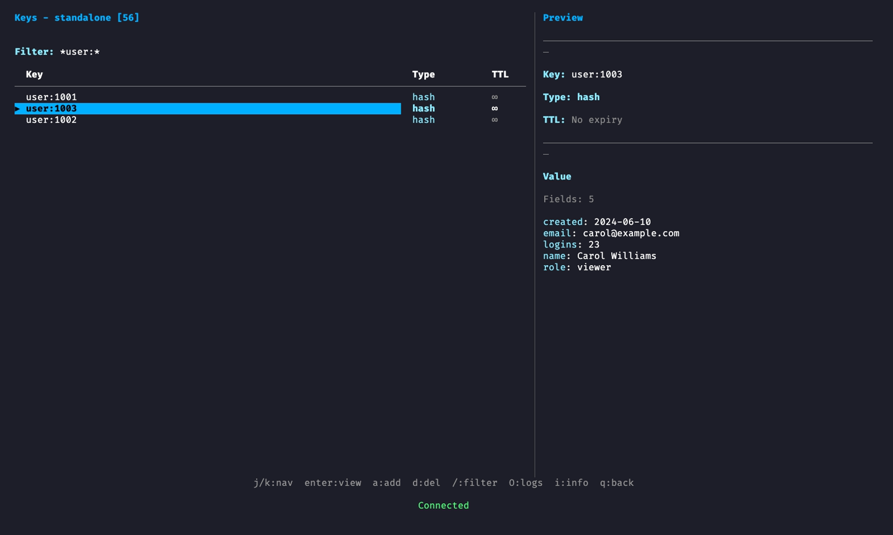
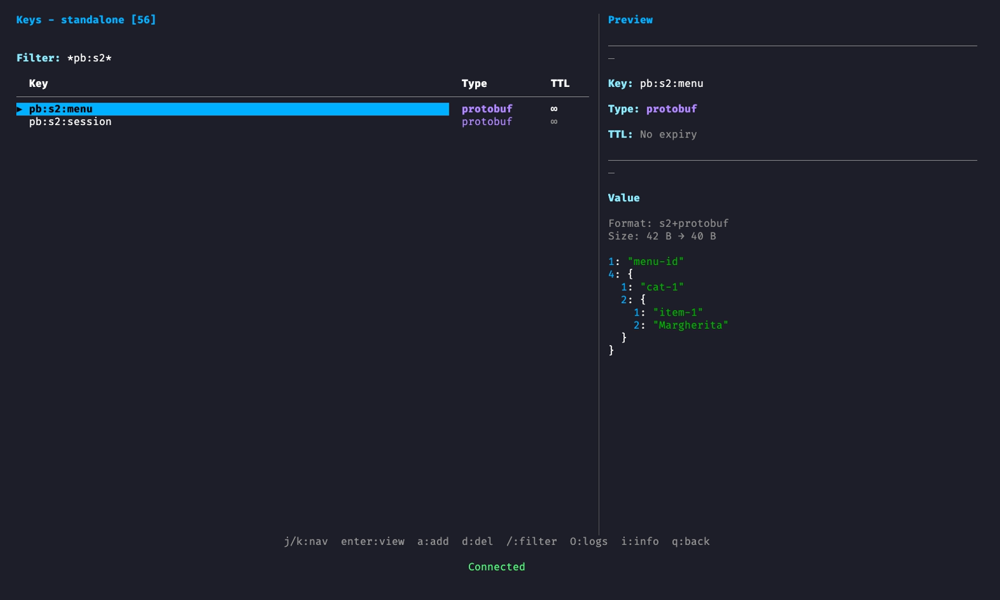
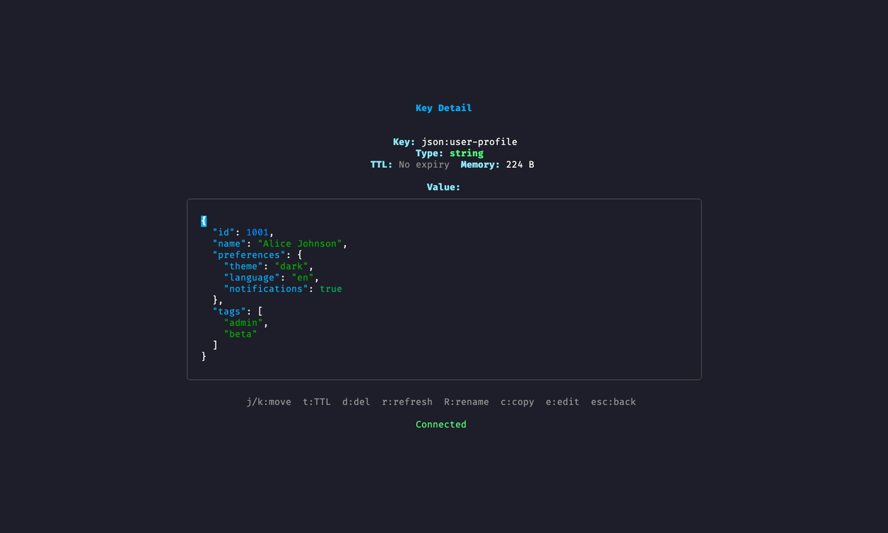

# Redis TUI Manager

[](https://github.com/davidbudnick/redis-tui/actions/workflows/ci.yml)
[](https://github.com/davidbudnick/redis-tui/actions/workflows/release.yml)
[](https://github.com/davidbudnick/redis-tui/actions/workflows/ci.yml)
[](https://opensource.org/licenses/MIT)

A feature-rich terminal UI for managing Redis databases, built with Go and [Bubble Tea](https://github.com/charmbracelet/bubbletea). Browse, edit, and monitor your Redis keys without leaving the terminal.



## Quick Install

```bash
# Native install — recommended (macOS and Linux)
curl -fsSL https://raw.githubusercontent.com/davidbudnick/redis-tui/main/install.sh | bash

# Homebrew (macOS and Linux)
brew tap davidbudnick/homebrew-tap
brew install --cask redis-tui

# Go (requires Go 1.26+)
go install github.com/davidbudnick/redis-tui@latest
```

> **Pre-built binaries** — [Download from GitHub Releases](https://github.com/davidbudnick/redis-tui/releases)

## Screenshots

### Key Browser

Browse the keyspace with type and TTL columns. Selecting a key loads a **bounded live preview** so huge values never block Redis.



### Live Preview Panel

Hashes, lists, JSON strings, and other types render in the side panel as you move with `j`/`k`.



### Protobuf & s2 Decoding

Raw protobuf and **s2-compressed** protobuf binary strings are detected and pretty-printed schema-less in preview and detail.



### Key Detail

Open any key for syntax-highlighted JSON, decoded protobuf, collection members, and edit/delete actions.



## Features

### Browsing and Editing

- **Key browser** with pattern filtering, regex, and fuzzy search
- **Bounded previews** — the preview panel fetches at most 100 items / 64 KB per key (marked "(preview — N total)" when truncated), so browsing huge keys never blocks the Redis server
- **All data types** — strings, lists, sets, sorted sets, hashes, streams, JSON (RedisJSON), HyperLogLog, bitmaps, geospatial, and protobuf
- **Protobuf decoding** — binary string values that are raw protobuf or **s2-compressed** protobuf (`github.com/klauspost/compress/s2`) are detected and pretty-printed schema-less (field numbers, nested messages, strings) in the detail and preview panels
- **Inline value editor** for editing string and JSON values
- **Tree view** for hierarchical key navigation
- **Favorites and recent keys** for quick access
- **Key templates** for creating keys from predefined structures
- **Value history** — view and restore previous values
- **JSON syntax highlighting**

### Connections and Security

- **CLI quick connect** — pass `--host`, `--port`, `--user`, `--password`, etc. to connect without a config file
- **Connection manager** — save and switch between multiple Redis instances
- **TLS/SSL** — enable via CLI flags (`--tls`, `--tls-ca`, etc.) or config file fields; the add/edit connection form does not expose TLS options yet
- **Database switching** between Redis databases (0-15)
- **Cluster support** — connect to any cluster node and press `C` to view all nodes, their roles (master/replica), slot ranges, and link state; cluster metrics in the live dashboard

### Monitoring and Operations

- **Live metrics dashboard** — real-time ops/sec, memory, CPU, network I/O, hit rate, and client count with scrolling ASCII charts; cluster node count display
- **Server info** — version, mode, OS, uptime, memory, and connected clients
- **Memory stats** — detailed usage breakdown and top keys by memory consumption
- **Slow log** — view slow query entries with execution time and command details
- **Client list** — view all connected Redis clients with address, age, and command info
- **Keyspace events** — subscribe to keyspace notifications (set, del, expire, etc.)
- **Export/Import** — JSON-based key backup and restore
- **Bulk operations** — pattern-based delete and batch TTL across multiple keys
- **Redis config** — browse and edit runtime CONFIG parameters
- **Pub/Sub** — browse active channels with subscriber counts and publish messages
- **Lua scripting** — execute Lua scripts directly against the server

### Coming soon / roadmap

These items have schema hooks or partial stubs in the codebase but are **not fully implemented** yet:

- **SSH tunneling** — `use_ssh` / `ssh_config` are reserved in config for future secure remote access (no SSH client yet)
- **Connection groups** — groups can be stored in config; no UI for browsing or assigning groups yet
- **Watch mode** — key-detail `w` can toggle a watch flag, but value refresh is not wired up; `watch_interval_ms` is unused by the UI
- **Themes** — no theme system yet (`ctrl+t` is used for test connection / add-key type cycle, not themes)
- **TLS in connection form** — TLS works via CLI and config file; form UI for certs/CA is planned

## Installation

### Native Install (Recommended)

The install script auto-detects your OS and architecture, downloads the latest release, verifies the checksum, and installs the binary to `~/.local/bin` (override with `INSTALL_DIR`):

```bash
curl -fsSL https://raw.githubusercontent.com/davidbudnick/redis-tui/main/install.sh | bash

# Custom install directory
INSTALL_DIR=/usr/local/bin curl -fsSL https://raw.githubusercontent.com/davidbudnick/redis-tui/main/install.sh | bash
```

### Homebrew

See [Quick Install](#quick-install) above.

### From Source

```bash
# Clone the repository
git clone https://github.com/davidbudnick/redis-tui.git
cd redis-tui

# Build
make build

# Install to GOPATH/bin
make install
```

### Pre-built Binaries

Download the latest release from the [Releases](https://github.com/davidbudnick/redis-tui/releases) page. Pre-built binaries are available for macOS, Linux, and Windows with no Go installation required.

### Using Go Install

> **Note:** Requires Go 1.26 or later.

```bash
go install github.com/davidbudnick/redis-tui@latest
```

## Usage

```bash
# Launch the interactive connection manager
redis-tui

# Quick connect to a Redis server
redis-tui --host localhost

# Connect with password and specific database
redis-tui -h redis.example.com -p 6380 -a mypassword -n 2

# Resolve the password from HashiCorp Vault
VAULT_ADDR=https://vault.example.com VAULT_TOKEN=... redis-tui \
  --host redis.example.com \
  --vault-path secret/data/redis/prod \
  --vault-username-key credentials.redis.username \
  --vault-password-key credentials.redis.password

# Connect to a cluster node
redis-tui --host redis.example.com --port 6380 --cluster

# Connect with TLS
redis-tui --host redis.example.com --tls --tls-ca /path/to/ca.pem

# Update to the latest version
redis-tui --update
```

1.0.42 and 1.0.43 fail `--update` when `/tmp` and the install dir are on different disks (`invalid cross-device link`). Those builds still honor `TMPDIR`, so this keeps `--update` on the same filesystem as `~/.local/bin`:

```bash
TMPDIR="$HOME" redis-tui --update
```

Or reinstall; the install script's `mv` already copies across devices:

```bash
curl -fsSL https://raw.githubusercontent.com/davidbudnick/redis-tui/main/install.sh | bash
```

When `--host` is provided the TUI connects automatically on startup. Without flags the interactive connection manager is shown.

Press `?` inside the app to view the full help screen.

### CLI Flags

| Flag                | Short | Description                                         | Default     |
| ------------------- | ----- | --------------------------------------------------- | ----------- |
| `--host`            | `-h`  | Redis server hostname                               |             |
| `--port`            | `-p`  | Redis server port                                   | 6379        |
| `--password`        | `-a`  | Redis password                                      |             |
| `--vault-path`      |       | Vault logical path containing Redis credentials     |             |
| `--vault-username-key` |    | Key selector containing the Redis username          |             |
| `--vault-password-key` |    | Key selector containing the Redis password          |             |
| `--db`              | `-n`  | Database number (0-15)                              | 0           |
| `--user`            |       | Redis username (For ACL enabled servers)            |             |
| `--name`            |       | Connection display name                             | `host:port` |
| `--cluster`         |       | Enable cluster mode                                 | false       |
| `--tls`             |       | Enable TLS/SSL                                      | false       |
| `--tls-cert`        |       | TLS client certificate file                         |             |
| `--tls-key`         |       | TLS client private key file                         |             |
| `--tls-ca`          |       | TLS CA certificate file                             |             |
| `--tls-skip-verify` |       | Skip TLS certificate verification                   | false       |
| `--scan-size`       |       | Redis SCAN COUNT hint (batch size for key scanning) | 1000        |
| `--include-types`   |       | Fetch key types during scan (set false to skip)     | true        |
| `--version`         |       | Print version and exit                              |             |
| `--update`          |       | Update to the latest version                        |             |

Short flags (`-h`, `-p`, `-a`, `-n`) follow [redis-cli](https://redis.io/docs/latest/develop/connect/cli/) conventions.

### Uninstall

```bash
# Native install
rm -f ~/.local/bin/redis-tui

# Homebrew
brew uninstall --cask redis-tui

# Go
rm -f $(go env GOPATH)/bin/redis-tui
```

<details>
<summary>Keyboard Shortcuts</summary>

### Global

| Key      | Action           | Key        | Action           |
| -------- | ---------------- | ---------- | ---------------- |
| `q`      | Quit / Go back   | `Ctrl+U/D` | Page up/down     |
| `?`      | Show help        | `g/G`      | Go to top/bottom |
| `j/k`    | Navigate up/down | `home/end` | Go to top/bottom |
| `Ctrl+C` | Force quit       |            |                  |

### Connections Screen

| Key     | Action              | Key                  | Action            |
| ------- | ------------------- | -------------------- | ----------------- |
| `Enter` | Connect to selected | `d/delete/backspace` | Delete connection |
| `a/n`   | Add new connection  | `r`                  | Refresh list      |
| `e`     | Edit connection     | `Ctrl+T`             | Test connection   |

### Keys Screen

| Key                  | Action                  | Key      | Action                 |
| -------------------- | ----------------------- | -------- | ---------------------- |
| `Enter`              | View key details        | `O`      | View logs              |
| `a/n`                | Add new key             | `B`      | Bulk delete            |
| `d/delete/backspace` | Delete key              | `T`      | Batch set TTL          |
| `r`                  | Refresh keys            | `F`      | View favorites         |
| `l`                  | Load more keys          | `W`      | Tree view              |
| `/`                  | Filter by pattern       | `Ctrl+R` | Regex search           |
| `s/S`                | Sort / Toggle direction | `Ctrl+F` | Fuzzy search           |
| `v`                  | Search by value         | `Ctrl+H` | Recent keys            |
| `e`                  | Export to JSON          | `Ctrl+L` | Client list            |
| `I`                  | Import from JSON        | `Ctrl+E` | Toggle keyspace events |
| `i`                  | Server info             | `Ctrl+X` | View expiring keys     |
| `D`                  | Switch database         | `m`      | Live metrics dashboard |
| `f`                  | Flush database          | `M`      | Memory stats           |
| `p`                  | Pub/Sub channels        | `C`      | Cluster info           |
| `L`                  | View slow log           | `K`      | Compare keys           |
| `E`                  | Execute Lua script      | `P`      | Key templates          |
| `Ctrl+G`             | Redis config            |          |                        |

### Key Detail Screen

| Key             | Action                   | Key   | Action                    |
| --------------- | ------------------------ | ----- | ------------------------- |
| `e`             | Edit value (string/json) | `r`   | Refresh value             |
| `a`             | Add to collection        | `f`   | Toggle favorite           |
| `x`             | Remove from collection   | `h`   | View value history        |
| `t`             | Set TTL                  | `y`   | Copy to clipboard         |
| `R`             | Rename key               | `J`   | JSON path query           |
| `c`             | Copy key                 | `j/k` | Navigate collection items |
| `d/delete`      | Delete key               |       |                           |
| `esc/backspace` | Go back to keys list     |       |                           |

</details>

## Docker Compose Examples

Need a Redis instance to try redis-tui? Docker Compose files are included under [`examples/`](examples/README.md).

```bash
# Standalone Redis on port 6379
docker compose -f examples/standalone/docker-compose.yml up -d
redis-tui -h localhost

# 6-node cluster (3 masters + 3 replicas) on ports 6380-6385
docker compose -f examples/cluster/docker-compose.yml up -d
redis-tui -h localhost -p 6380 --cluster

# Standalone Redis Stack (RedisJSON, RediSearch, etc.) on port 6390
docker compose -f examples/standalone-redis-stack/docker-compose.yml up -d
redis-tui -h localhost -p 6390

# Redis Stack cluster on ports 6386-6392
docker compose -f examples/cluster-redis-stack/docker-compose.yml up -d
redis-tui -h localhost -p 6386 --cluster
```

`make docker-up` / `make docker-seed` start and seed the default plain Redis instances (standalone + cluster). Redis Stack is optional via `make docker-up-standalone-stack`, `make docker-up-cluster-stack`, or `make docker-up-all`.

## Configuration

Configuration is stored in `~/.config/redis-tui/config.json`.

### Example Configuration

```json
{
  "connections": [
    {
      "id": 1,
      "name": "Standalone",
      "host": "localhost",
      "port": 6379,
      "username": "default",
      "vault_path": "secret/data/redis/standalone",
      "vault_username_key": "credentials.redis.username",
      "vault_password_key": "credentials.redis.password",
      "db": 0,
      "created_at": "2025-01-01T00:00:00Z",
      "updated_at": "2025-01-01T00:00:00Z"
    },
    {
      "id": 2,
      "name": "Cluster",
      "host": "localhost",
      "port": 6380,
      "db": 0,
      "use_cluster": true,
      "created_at": "2025-01-01T00:00:00Z",
      "updated_at": "2025-01-01T00:00:00Z"
    }
  ],
  "groups": [
    {
      "name": "local",
      "color": "#50fa7b",
      "connections": [1, 2]
    }
  ],
  "favorites": [
    {
      "connection_id": 1,
      "connection": "Standalone",
      "key": "app:config",
      "label": "App Settings",
      "added_at": "2025-01-15T10:30:00Z"
    }
  ],
  "recent_keys": [
    {
      "connection_id": 1,
      "key": "session:abc123",
      "type": "hash",
      "accessed_at": "2025-01-20T14:00:00Z"
    }
  ],
  "templates": [
    {
      "name": "Session",
      "description": "User session data",
      "key_pattern": "session:{user_id}",
      "type": "hash",
      "default_ttl": 86400000000000,
      "fields": {
        "token": "",
        "created_at": "",
        "user_agent": ""
      }
    },
    {
      "name": "Cache",
      "description": "Cached data with TTL",
      "key_pattern": "cache:{resource}:{id}",
      "type": "string",
      "default_ttl": 3600000000000
    },
    {
      "name": "Rate Limit",
      "description": "Rate limiting counter",
      "key_pattern": "ratelimit:{ip}:{endpoint}",
      "type": "string",
      "default_ttl": 60000000000,
      "default_value": "0"
    },
    {
      "name": "Queue",
      "description": "Job queue",
      "key_pattern": "queue:{name}",
      "type": "list"
    },
    {
      "name": "Leaderboard",
      "description": "Sorted leaderboard",
      "key_pattern": "leaderboard:{game}",
      "type": "zset"
    }
  ],
  "tree_separator": ":",
  "max_recent_keys": 20,
  "max_value_history": 50,
  "watch_interval_ms": 1000
}
```

> **Note:** Passwords and SSH passphrases are never saved to the config file. They are stripped before serialization for security. The config file is written with `0600` permissions (owner read/write only).

### HashiCorp Vault passwords

The interactive connection form and CLI quick-connect mode accept a Vault path plus username and password key selectors. redis-tui uses HashiCorp's official [`github.com/hashicorp/vault/api`](https://pkg.go.dev/github.com/hashicorp/vault/api) client and its standard environment variables, including `VAULT_ADDR`, `VAULT_TOKEN`, `VAULT_NAMESPACE`, `VAULT_CACERT`, and `VAULT_CLIENT_CERT`/`VAULT_CLIENT_KEY`. When `VAULT_TOKEN` is unset, redis-tui also uses the official Vault CLI token helper configuration, including the default `~/.vault-token` file.

Use the full logical API path without the `/v1/` prefix. For KV v2 this includes `data/`, such as `secret/data/redis/prod`; for KV v1 it may be `secret/redis/prod`. KV v2 response data is unwrapped automatically. Dot-separated selectors traverse nested maps, so `credentials.redis.password` selects `password` inside `redis` inside `credentials`. A `vault_path` and at least one of `vault_username_key` or `vault_password_key` are required. Vault values take precedence over literal username/password values.

> **TTL format:** `default_ttl` values in templates use Go's `time.Duration` nanosecond encoding: 1s = `1000000000`, 1m = `60000000000`, 1h = `3600000000000`.

> **Reserved / planned fields:** `groups`, `group`, `use_ssh`, `ssh_config`, and `watch_interval_ms` are kept for forward compatibility. SSH tunneling, connection-group UI, and functional watch mode are not implemented yet (see [Coming soon / roadmap](#coming-soon--roadmap)).

### Connection Options

| Option                            | Description                                                 |
| --------------------------------- | ----------------------------------------------------------- |
| `name`                            | Display name for the connection                             |
| `host`                            | Redis server hostname or IP                                 |
| `port`                            | Redis server port (default: 6379)                           |
| `password`                        | Redis password (never saved to disk)                        |
| `vault_path`                      | Full Vault logical path containing Redis credentials         |
| `vault_username_key`              | Dot-separated selector for the Redis username               |
| `vault_password_key`              | Dot-separated selector for the Redis password               |
| `db`                              | Redis database number (0-15)                                |
| `username`                        | Redis ACL username (optional)                               |
| `group`                           | Connection group name (optional; UI not wired yet)          |
| `color`                           | Display color for the connection (optional)                 |
| `use_tls`                         | Enable TLS/SSL connection (CLI/config; not in form UI yet)  |
| `tls_config.cert_file`            | Client certificate file path                                |
| `tls_config.key_file`             | Client key file path                                        |
| `tls_config.ca_file`              | CA certificate file path                                    |
| `tls_config.insecure_skip_verify` | Skip TLS certificate verification                           |
| `tls_config.server_name`          | TLS server name for verification                            |
| `use_ssh`                         | Reserved: enable SSH tunneling (not implemented yet)        |
| `ssh_config.host`                 | Reserved: SSH server hostname                               |
| `ssh_config.port`                 | Reserved: SSH server port                                   |
| `ssh_config.user`                 | Reserved: SSH username                                      |
| `ssh_config.password`             | Reserved: SSH password (never saved to disk)                |
| `ssh_config.private_key_path`     | Reserved: path to SSH private key file                      |
| `ssh_config.passphrase`           | Reserved: passphrase for encrypted key (never saved)        |
| `use_cluster`                     | Enable Redis cluster mode                                   |

## Requirements

- Go 1.26 or later (for building from source or `go install`)
- A terminal that supports 256 colors
- Redis server 4.0 or later

## Supported Platforms

- macOS (Intel and Apple Silicon)
- Linux (amd64, arm64)
- Windows (amd64)

## Development

```bash
# Install development dependencies
make dev-deps

# Run the application
make run

# Run tests
make test

# Run tests with coverage
make test-cover

# Run performance benchmarks (key scans, preview fetches, rendering)
make bench

# Run linter
make lint

# Format code
make fmt

# Build the application
make build

# Build for all platforms
make build-all

# Clean build artifacts
make clean

# Create a release with goreleaser
make release

# Create a snapshot release (no publish)
make snapshot
```

## License

MIT License - see [LICENSE](LICENSE) for details.

## Contributing

Contributions are welcome! Please feel free to submit a Pull Request.

1. Fork the repository
2. Create your feature branch (`git checkout -b feature/amazing-feature`)
3. Run tests before committing: `go test -v -race ./...`
4. Commit your changes using [conventional commits](https://www.conventionalcommits.org/) (`feat:`, `fix:`, `refactor:`, etc.)
5. Push to the branch (`git push origin feature/amazing-feature`)
6. Open a Pull Request

### Before submitting

- All tests must pass with the race detector: `go test -v -race ./...`
- Run `make lint` and `make fmt`
- Never suppress errors in tests — every error return must be checked
- Config changes must include persistence round-trip tests (add data, reload from disk, assert fields survived)
- See [CLAUDE.md](CLAUDE.md) for code conventions, architecture, and guardrails

## Acknowledgments

- [Bubble Tea](https://github.com/charmbracelet/bubbletea) - TUI framework
- [Lip Gloss](https://github.com/charmbracelet/lipgloss) - Styling library
- [Bubbles](https://github.com/charmbracelet/bubbles) - TUI components
- [go-redis](https://github.com/redis/go-redis) - Redis client
- [miniredis](https://github.com/alicebob/miniredis) - In-memory Redis used in tests
- [chroma](https://github.com/alecthomas/chroma) - Syntax highlighting for JSON values

## Keywords

redis, redis-cli, redis-client, redis-tui, redis-gui, redis-manager, terminal, tui, cli, go, golang, database, key-value, cache, devops, sysadmin
